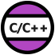

# VSCode and ROS2

This documentation outlines the procedures for setting up Visual Studio Code (VSCode) to effectively build and execute ROS2 projects.

## Initialization of Visual Studio Code

For the purpose of this guide, it is presumed that Visual Studio Code has already been installed on your system without any additional extensions. In an Ubuntu environment, the extensions are commonly stored in the following directory:

```
~/.vscode
```

To open an existing ROS2 repository, initiate a terminal and navigate to your ROS2 workspace. It is crucial to ensure you are in the root workspace directory. For instance:

```
~/user/my_project
```

Execute the following command to open this directory in VSCode:

```
code .
```

Upon launching VSCode, proceed to install the Microsoft ROS extension, followed by a restart of the editor.


This extension will facilitate the installation of requisite dependencies such as the C/C++ and Python extensions.



VSCode will prompt you to install the "C/C++ Extension Pack" which provides intellisense and C++ file navigation. Please comply with this request. It will install the CMake extension from twsx too.

You may need to enable intellisense in your VSCode Preferences Settings. 


## Configuration Files

You may observe that VSCode generates a `.vscode` folder containing two configuration files:

```
c_cpp_properties.json
settings.json
```

Follwing a working example of `c_cpp_properties.json`:

```
{
  "configurations": [
    {
      "browse": {
        "databaseFilename": "${default}",
        "limitSymbolsToIncludedHeaders": false
      },
      "includePath": [
        "${workspaceFolder}/**",
        "/opt/ros/humble/include/**",
        "/usr/include/**"
      ],
      "name": "ROS",
      "intelliSenseMode": "gcc-x64",
      "compilerPath": "/usr/bin/gcc",
      "cStandard": "gnu11",
      "cppStandard": "c++17"
    }
  ],
  "version": 4
}
```

## Navigation and Shortcuts

You may conveniently toggle between `.cpp` and `.hpp` files using the following keyboard shortcut:

`Alt + O`

## Build Task Configuration

At this stage, no build task has been defined. To rectify this, create a `tasks.json` file within the `.vscode` folder and populate it with the following content:

```
{
    "version": "2.0.0",
    "tasks": [
        {
            "label": "build",
            "type": "shell",
            "command": "colcon build --cmake-args -DCMAKE_BUILD_TYPE=Debug --symlink-install --event-handlers log-"
        },
        {
            "label": "clean",
            "type": "shell",
            "command": "rm -rf build/ install/ log/",
            "problemMatcher": []
        },
        {
            "label": "test",
            "type": "shell",
            "command": "colcon test && colcon test-result"
        }
    ]
}
```

To execute a build, navigate to the "Run build task..." option within the Terminal menu. The system will automatically locate and initiate the build task as specified in the aforementioned `tasks.json` file. Alternatively, use the keyboard shortcut:

`Ctrl + Shift + B

## Debugging

Another useful extention is "C++ TestMate" to launch and debug GTests directly within VSCode.


Please note that for this extension to work correctly, you may need to source your ROS repository before starting up VSCode from the terminal. 

```source install/setup.bash; code .```

To debug your test you must create a `launch.json` file inside your `.vscode` directory. The file is automatically created for you when you debug your first test. 

```
{
    "version": "0.2.0",
    "configurations": [
        {
            "name": "(gdb) Launch",
            "type": "cppdbg",
            "request": "launch",
            "program": "enter program name, for example ${workspaceFolder}/a.out",
            "args": [],
            "stopAtEntry": false,
            "cwd": "${fileDirname}",
            "environment": [],
            "externalConsole": false,
            "MIMode": "gdb",
            "setupCommands": [
                {
                    "description": "Enable pretty-printing for gdb",
                    "text": "-enable-pretty-printing",
                    "ignoreFailures": true
                },
                {
                    "description": "Set Disassembly Flavor to Intel",
                    "text": "-gdb-set disassembly-flavor intel",
                    "ignoreFailures": true
                }
            ]
        }
    ]
}
```

## TODO

* Execute and debug Python launch files.

* Remote developing.

* Developing with Docker.

## Additional Resources

For additional information about ROS2 and VSCode, you may refer to the following tutorials:

* https://www.youtube.com/watch?v=hf76VY0a5Fk
* https://www.allisonthackston.com/articles/vscode-docker-ros2.html
