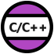
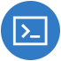
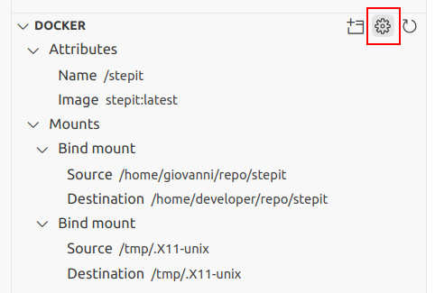

# ROS2 and VSCode


This documentation outlines the procedures for setting up Visual Studio Code (VSCode) to build and execute ROS2 projects effectively.

## Table of Contents

- [ROS2 and VSCode](#ros2-and-vscode)
  - [Table of Contents](#table-of-contents)
  - [Initialization of Visual Studio Code](#initialization-of-visual-studio-code)
  - [Remote development over SSH](#remote-development-over-ssh)
  - [Development on Docker](#development-on-docker)
  - [How to build with Colcon](#how-to-build-with-colcon)
  - [Sourcing your ROS Dependencies](#sourcing-your-ros-dependencies)
  - [Working in C++](#working-in-c)
    - [Navigation and Shortcuts](#navigation-and-shortcuts)
    - [Debugging tests](#debugging-tests)
  - [Working in Python](#working-in-python)
    - [Intellisense](#intellisense)
    - [Sorting imports](#sorting-imports)
    - [Debugging Python files](#debugging-python-files)
  - [Additional extensions](#additional-extensions)
    - [General](#general)
    - [Python](#python)
  - [Additional Resources](#additional-resources)

## Initialization of Visual Studio Code

For the purpose of this guide, it is presumed that Visual Studio Code has already been installed on your system without any additional extensions. In an Ubuntu environment, the extensions are commonly stored in the following directory:

```
~/.vscode
```

Upon launching VSCode, proceed to install the Microsoft ROS extension, followed by a restart of the editor.


This extension will facilitate the installation of requisite dependencies such as Microsoft C/C++ and Microsoft Python extensions.



Install the "C/C++ Extension Pack" which provides Intellisense and C++ file navigation. This will install the CMake extension from twsx too.


You may need to enable Intellisense in your VSCode Preferences Settings.

## Remote development over SSH

VSCode can be used to develop remotely over SSH. You must install an extension called Microsoft Remote SSH. This extension will also add a button on the left toolbar to display all available Docker containers.



Open the command palette and type: "Remote-SSH: Connect to Host...".

## Development on Docker

VSCode can be used to develop on Docker. You must install an extension called Microsoft Dev Containers, which you can use to connect to running containers. You can easily install your local VSCode extensions into the container.


More information here: https://code.visualstudio.com/docs/devcontainers/attach-container


## How to build with Colcon

To run the `colcon` command from VSCode, you need to create a `task.json` file within the `.vscode` folder and populate it with the following content:

```yaml
{
    "version": "2.0.0",
    "tasks": [
        {
          "label": "colcon: build (debug)",
          "type": "colcon",
          "group": "build",
          "args": [
            "build",
            "--symlink-install",
            "--event-handlers",
            "console_cohesion+",
            "--base-paths",
            "project-workspace",
            "--cmake-args",
            "-DCMAKE_BUILD_TYPE=RelWithDebInfo"
          ]
        },
        {
            "label": "Colcon: clean",
            "type": "shell",
            "command": [
                "cd project-workspace;",
                "rm -rf build/ install/ log/;"
            ]
            "problemMatcher": []
        },
        {
            "label": "Colcon: test",
            "type": "shell",
            "command": [
                "cd project-workspace;",
                "source /opt/ros/humble/setup.bash;",
                "source install/setup.bash;",
                "colcon test;",
                "colcon test-result --verbose;"
            ]
        }
    ]
}
```

Modify the file according to your ROS2 distribution and project location.

Choose *"Terminal → Run build task..."* from the menu to build your project. The system will automatically locate and initiate the build task specified in the aforementioned `tasks.json` file. Alternatively, use the keyboard shortcut:

`Ctrl + Shift + B`

Using the same approach, you can also execute any ROS2 launch files.

## Sourcing your ROS Dependencies

When you execute or debug a file in your project, it may fail to find its runtime dependencies and throw an error in the Debug Console. There are different solutions for this issue.

**Solution 1**

You can source your project in the same Debug Console and try again.

`source install/setup.bash`

**Solution 2**

You can modify the user `.bashrc` to source your project whenever you attach VSCode to the container.

**Solution 3**

If you do not want to run a command each time you start a debug session and you cannot modify the file `.bashrc`, here is a more versatile approach.

You want to execute a `source` command every time VSCode opens the container. The VSCode DevContainer extension allows you to edit the JSON container configuration file, providing a field for this purpose. Open the configuration file by clicking on the highlighted cog.



Add the following field to modify the `.bashrc` each time you connect VSCode to the container. `TAG` is a unique ID to verify if the command has already been added.

```yaml
"postAttachCommand": "grep -qF 'TAG' $HOME/.bashrc || echo 'source project-workspace/install/setup.bash # TAG' >> $HOME/.bashrc"
```

The container configuration file is usually stored somewhere inside this folder:

```bash
$HOME/.config/Code/User/globalStorage/ms-vscode-remote.remote-containers/
```

## Working in C++

If you open an existing ROS2 project that contains C++ source code, you may observe that VSCode generates a `.vscode` folder containing two configuration files:

```
c_cpp_properties.json
settings.json
```

If `c_cpp_properties.json` is not created, you can create a new one by opening the command palette and typing *"C++: Edit Configurations (UI)"*.
Update it to match roughly the following content:

```yaml
{
  "configurations": [
    {
      "browse": {
        "databaseFilename": "${default}",
        "limitSymbolsToIncludedHeaders": false
      },
      "includePath": [
        "${workspaceFolder}/**",
        "/opt/ros/humble/include/**",
        "/usr/include/**"
      ],
      "name": "ROS",
      "intelliSenseMode": "gcc-x64",
      "compilerPath": "/usr/bin/gcc",
      "cStandard": "gnu11",
      "cppStandard": "c++17"
    }
  ],
  "version": 4
}
```

### Navigation and Shortcuts

You may conveniently toggle between `.cpp` and `.hpp` files using the following keyboard shortcut:

`Alt + O`

### Debugging tests

Another useful extension is "C++ TestMate" to launch and debug GTests directly within VSCode.


Please note that for this extension to work correctly, you may need to source your ROS repository before starting up VSCode from the terminal.

`source install/setup.bash; code .`

To debug your test, you must create a `launch.json` file inside your `.vscode` directory. The file is automatically created for you when you debug your first test.

```yaml
{
    "version": "0.2.0",
    "configurations": [
        {
            "name": "GDP: launch",
            "type": "cppdbg",
            "request": "launch",
            "program": "enter program name, for example, ${workspaceFolder}/a.out",
            "args": [],
            "stopAtEntry": false,
            "cwd": "${fileDirname}",
            "environment": [],
            "externalConsole": false,
            "MIMode": "gdb",
            "setupCommands": [
                {
                    "description": "Enable pretty-printing for gdb",
                    "text": "-enable-pretty-printing",
                    "ignoreFailures": true
                },
                {
                    "description": "Set Disassembly Flavor to Intel",
                    "text": "-gdb-set disassembly-flavor intel",
                    "ignoreFailures": true
                }
            ]
        }
    ]
}
```

## Working in Python

More information is available here:
https://code.visualstudio.com/docs/python/python-tutorial

### Intellisense

When you open an existing ROS2 Python project, IntelliSense does not find your ROS2 Python modules or your local package modules. To solve the issue, create a file `settings.json` with content matching roughly the following:

```yaml
{
    // This is used by IntelliSense for autocompletion and signatures.
    "python.autoComplete.extraPaths": [
        "/opt/ros/humble/lib/python3.10/site-packages", 
        "/opt/ros/humble/local/lib/python3.10/dist-packages",
        "/my_project/build/package1",
        "/my_project/build/package2"
    ],
    // This is used for static code analysis.
    "python.analysis.extraPaths": [
        "/opt/ros/humble/lib/python3.10/site-packages", 
        "/opt/ros/humble/local/lib/python3.10/dist-packages",
        "/my_project/build/package1",
        "/my_project/build/package2"
    ]
}
```

All Python dependencies are stored in the environment variable `PYTHONPATH`. Unfortunately, VSCode does not use it. To get the list of all libraries, source your project and type the following bash command:

```bash
IFS=:; for path in $PYTHONPATH; do echo "\"$path\","; done
```

### Sorting imports

To sort imports in a Python module, open the command palette and type *"Organize imports"*. You can also use the following shortcut:

`Shif + Alt + O`

### Debugging Python files

To debug a normal Python file, you must create a `launch.json` file inside your `.vscode` directory.

```yaml
{
    "version": "0.2.0",
    "configurations": [
        {
            "name": "Python: Current File",
            "type": "python",
            "request": "launch",
            "program": "${file}",
            "args": [""], // Only if you need parameters
            "console": "integratedTerminal",
            "justMyCode": true
        }
    ]
}
```

To debug a ROS2 Python launch file, you can open a command palette and type *"ROS: Run a ROS launch file (roslaunch)"* to add a new launch configuration to your `launch.json`. You can also add it manually.

```yaml
{
    "version": "0.2.0",
    "configurations": [
        ...
        {
            "name": "ROS: Launch",
            "type": "ros",
            "request": "launch",
            "target": "/absolute-path/launch-file.py"
        },
        ...
    ]
}
```

The ROS2 extension allows you to debug a running node as well.

```yaml
{
    "version": "0.2.0",
    "configurations": [
        ...
        {
        {
            "name": "ROS: Attach",
            "type": "ros",
            "request": "attach"
        },
        ...
    ]
}
```

Following is a more complex solution that requires you to modify the Python file. Add this code to the end of the launch file to convert it to a normal Python file:

```python
def main():
    ls = launch.LaunchService()
    ld = generate_launch_description()
    ls.include_launch_description(ld)
    return ls.run()

if __name__ == '__main__':
    main()
```

Using an "opaque function" allows you to debug the values of launch parameters. However, together with the previous change, you'll need to modify the launch file, as demonstrated in the following example.

```python
def launch_setup(context, *args, **kwargs):
    my_param = LaunchConfiguration("param_name")

def generate_launch_description():
    return LaunchDescription(
        [
            DeclareLaunchArgument(
                "param_name",
                default_value="param_value",
                description=("param_description"),
            ),
            ...,
            OpaqueFunction(function=launch_setup),
        ]
    )
```

In VSCode, we can add a breakpoint and display the content of this variable with a watch:

```python
my_param.perform(context)
```

## Additional extensions

### General

* **Back & Forth:** Extension to add go back/forward buttons to the title bar for easier navigation through recent edit locations and opened files.

* **CodeSnap:** Extension to take screenshots of your code.

* **Debug Visualizer:** Extension for visualizing data structures while debugging. Like the watch view, but with rich visualizations of the watched value.

* **Error Lens:** Extension to better display errors in the code.

* **Markdown All in One:** Extension for Markdown advanced editing. It adds a document outline, automatic table of contents, etc.

* **Microsoft Live Share:** Extension to share your editor for real-time collaborative development.

* **Protobuf (Protocol Buffers):** Extension to add Protobuf support, powered by Pbkit language server.

* **Task Runner (forbeslindesay v1.0.0):** Extension to display tasks to run on the left panel.

* **UMLet:** Draw UML diagrams inside VSCode.

### Python

* **Astral Software Ruff:** Support for the Ruff linter.

* **Debug Launcher:** Start debugging without having to define any tasks or launch configurations, even from the terminal.

* **Microsoft Black Formatter:** An automatic Python code formatted.

* **Microsoft Jupyter:** Extension to edit and run Jupyter notebooks.

* **Microsoft Pylint**:  Support for the Pylint linter.

* **Microsoft Pylance**: This is a powerful tool that enhances the Python development experience in Visual Studio Code by providing tools for code analysis, error checking, code navigation, and code completion. 

## Additional Resources

For additional information about ROS2 and VSCode, you may refer to the following tutorials:

- https://www.youtube.com/watch?v=hf76VY0a5Fk
- https://www.allisonthackston.com/articles/vscode-docker-ros2.html
