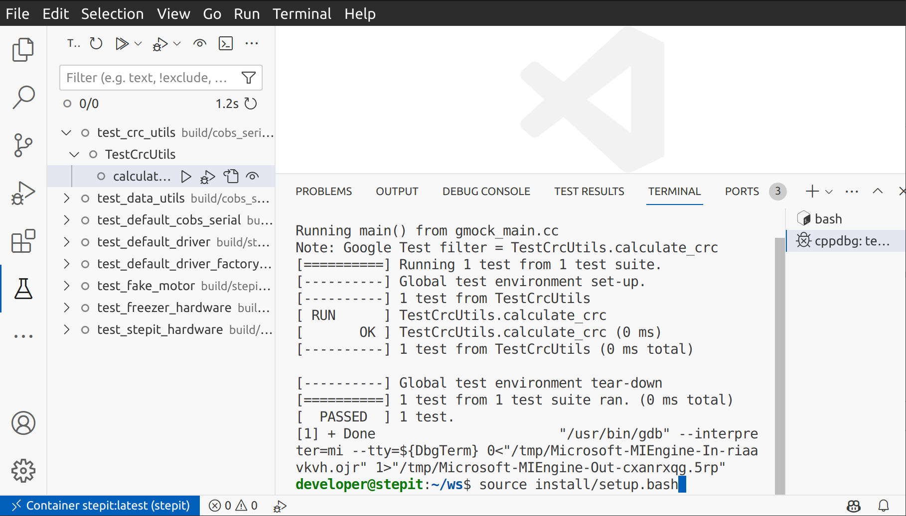

# ROS2 and VSCode <!-- omit from toc -->


This document provides a detailed guide for using Visual Studio Code (VSCode) to build and execute ROS2 projects efficiently with C++ and Python.
It covers a range of topics, including initializing VSCode, remote development over SSH, development using Docker, sourcing ROS dependencies, and building with Colcon.
The document also delves into specific techniques for working in C++ and Python within the ROS2 environment, offering valuable insights and tips to enhance the development process.

## Table of Contents <!-- omit from toc -->

- [Configuration files examples](#configuration-files-examples)
- [Initialization of Visual Studio Code](#initialization-of-visual-studio-code)
- [Remote development over SSH](#remote-development-over-ssh)
- [Developmenti in Docker container](#developmenti-in-docker-container)
- [Development in remote Docker container](#development-in-remote-docker-container)
- [Sourcing your ROS Dependencies](#sourcing-your-ros-dependencies)
- [How to build with Colcon](#how-to-build-with-colcon)
- [How to build with CMake](#how-to-build-with-cmake)
- [Working in C++](#working-in-c)
  - [Navigation and Shortcuts](#navigation-and-shortcuts)
  - [Debugging tests](#debugging-tests)
- [Working in Python](#working-in-python)
  - [Intellisense](#intellisense)
  - [Sorting imports](#sorting-imports)
  - [Debugging Python files](#debugging-python-files)
  - [Discover and execute tests](#discover-and-execute-tests)
  - [Code coverage](#code-coverage)
- [Tips](#tips)
  - [Highlight current tab](#highlight-current-tab)
  - [Ignore .vscode folder in Git](#ignore-vscode-folder-in-git)
- [Additional extensions](#additional-extensions)
  - [General](#general)
  - [Python](#python)
- [Additional Resources](#additional-resources)

## Configuration files examples

For a quick reference, you can find examples of VSCode configuration files
[here](examples/examples.md).

## Initialization of Visual Studio Code

For this guide, it is presumed that Visual Studio Code has already been installed on your system without additional extensions. In an Ubuntu environment, the extensions are commonly stored in the following directory:

```
~/.vscode
```

Upon launching VSCode, install the [Microsoft ROS extension](https://marketplace.visualstudio.com/items?itemName=ms-iot.vscode-ros), followed by a restart of the editor.


This extension will facilitate the installation of requisite dependencies such as [Microsoft C/C++](https://marketplace.visualstudio.com/items?itemName=ms-vscode.cpptools) and [Microsoft Python](https://marketplace.visualstudio.com/items?itemName=ms-python.python) extensions.


Install the [C/C++ Extension Pack](https://marketplace.visualstudio.com/items?itemName=ms-vscode.cpptools-extension-pack), which provides Microsoft Intellisense and C++ file navigation. This will install the [CMake extension](https://marketplace.visualstudio.com/items?itemName=twxs.cmake) too.


Clangd works better than Microsoft Intellisense in highlighting code, and it is expecially good at refactoring.
You must install both [Clangd](https://marketplace.visualstudio.com/items?itemName=llvm-vs-code-extensions.vscode-clangd) extension and the clangd language server. You can either install clangd as below, or follow the pop-up prompt from the clangd extension asking you to install the language server.

```bash
sudo apt install clangd
```

By default, Clangd looks a for file called `compile_commands.json` inside the build folder. To generate this file you must add the following [option](https://cmake.org/cmake/help/latest/variable/CMAKE_EXPORT_COMPILE_COMMANDS.html) to your cmake command:

```bash
-DCMAKE_EXPORT_COMPILE_COMMANDS=ON
```

Remember to reload vscode when you recreate the file `compile_commands.json`.

With Clangd, the build command in the `tasks.json` file may look something like this:

```bash
{
  "version": "2.0.0",
  "tasks": [
    {
      "label": "colcon: build",
      "type": "shell",
      "command": [
        "source /opt/ros/humble/setup.bash;",
        "colcon",
        "--log-base ${env:WORKSPACE}/log",
        "build",
        "--build-base ${env:WORKSPACE}/build",
        "--install-base ${env:WORKSPACE}/install",
        "--base-path ${env:WORKSPACE}/path-to-subproject",
        "--symlink-install",
        "--event-handlers console_cohesion+",
        "--cmake-args -DCMAKE_BUILD_TYPE=Debug -DCMAKE_EXPORT_COMPILE_COMMANDS=true"
      ],
      "problemMatcher": [],
      "group": {
        "kind": "build",
        "isDefault": true
    },
    {
      "label": "colcon: clean",
      "type": "shell",
      "command": [
          "cd ${env:WORKSPACE};",
          "rm -rf build;",
          "rm -rf install;",
          "rm -rf log;"
      ]
    }
  ]
}
```

We assume `WORKSPACE` to be a global variable pointing to the root of your workspace.

You also need the following information in your VSCode `settings.json` file to you specify the location of the folder containing the `compile_commands.json` file and disable Microsoft Intellisense.

```bash
  "clangd.path": "<path-to-clangd-binary>",
  "clangd.arguments": [
    "-log=verbose",
    "-pretty",
    "--background-index",
    "--compile-commands-dir=<path-to-compile-commands-folder>"
```

## Remote development over SSH

VSCode can be used to develop remotely over SSH. You must install an extension called [Microsoft Remote SSH](https://marketplace.visualstudio.com/items?itemName=ms-vscode-remote.remote-ssh). This extension will also add a button on the left toolbar to display all available Docker containers.


Open the command palette and type: "Remote-SSH: Connect to Host...".

## Developmenti in Docker container

VSCode can be used to develop on Docker. You must install an extension called [Microsoft Dev Containers](https://marketplace.visualstudio.com/items?itemName=ms-vscode-remote.remote-containers), which you can use to connect to running containers. With this extension, you can also install your local VSCode extensions into the container in one click.


You should also install the extension called [Microsoft Docker](https://marketplace.visualstudio.com/items?itemName=ms-azuretools.vscode-docker), which allows you to work with containers and images.

For more information, see the VSCode document [Attach to a running container](https://code.visualstudio.com/docs/devcontainers/attach-container).

## Development in remote Docker container

VSCode can be used to develop inside a remote Docker container, i.e. a container running on a remote machine.

To achive this, you must install an extension called [Microsoft Remote Development](https://marketplace.visualstudio.com/items?itemName=ms-vscode-remote.vscode-remote-extensionpack).


First you connect to the remote machine using Microsoft Remote SSH, an then you connect to the running container using this extension.

## Sourcing your ROS Dependencies

When you execute or debug a file in your project, it may fail to find its runtime dependencies and throw an error in the Debug Console. There are different solutions for this issue.

**Solution 1 - for local development**

You can source your project in the same Debug Console and try again.

`source install/setup.bash`



**Solution 2 - for local development**

You can modify the user `.bashrc` to source your project whenever you attach VSCode to the container.

**Solution 3 - for docker containers**

If you do not want to run a command each time you start a debug session and you cannot modify the file `.bashrc`, here is a more versatile approach.

You want to execute a `source` command every time VSCode opens the container. The VSCode DevContainer extension allows you to edit the JSON container configuration file, providing a field for this purpose. Open the configuration file by clicking on the highlighted cog.


Add the following field to modify the `.bashrc` each time you connect VSCode to the container. `TAG` is a unique ID to verify if the command has already been added.

```json
"postAttachCommand": "grep -qF 'TAG' $HOME/.bashrc || echo 'source project-workspace/install/setup.bash # TAG' >> $HOME/.bashrc"
```

The container configuration file is usually stored somewhere inside this folder:

```bash
$HOME/.config/Code/User/globalStorage/ms-vscode-remote.remote-containers/
```

**Solution 4 - Utilize environment files**

Alternatively, you may utilize vscode's `.env` files to debug with ROS2. To start, add a file named `generate_env.sh` within the `.vscode` folder and populate it with the following content:

```bash
#!/bin/bash
filename=.vscode/.env
echo "PATH=$PATH" > $filename
echo "LD_LIBRARY_PATH=$LD_LIBRARY_PATH" >> $filename
```

This bash script simply prints your shell's `PATH` and `LD_LIBRARY_PATH` variables into a file, using [VSCode's `.env` file format](https://code.visualstudio.com/docs/python/environments#_environment-variable-definitions-file). To use this with your actual environment, simply add the following to your build task:

```bash
source install_dbg/setup.bash && cd ${workspaceFolder} && source .vscode/generate_env.sh
```

A full example build task with this included is given below:

```json
{
  "type": "shell",
  "label": "Debug build",
  "command": "source /opt/ros/rolling/setup.bash && nice colcon build --symlink-install --mixin debug compile-commands ccache --build-base build_dbg --install-base install_dbg && source install_dbg/setup.bash && cd ${workspaceFolder} && source .vscode/generate_env.sh && echo Debug build complete",
  "options": {
    "cwd": "${workspaceFolder}/../.."
  },
  "group": {
    "kind": "build",
    "isDefault": true
  },
  "presentation": {
    "echo": true,
    "reveal": "always",
    "focus": true,
    "panel": "shared",
    "showReuseMessage": true,
    "clear": true
  }
}
```

This builds in debug mode, putting the output in `build_dbg` and `install_dbg` instead of `build` and `install` (in case you wish to have two separate builds of your code), then sources the generated `setup.bash` file and stores the relevant information for debugging in your `.vscode/.env` file.

Finally, to use this file, you can just add the following to a configuration within your `launch.json`:

```json
"envFile": "${workspaceFolder}/.vscode/.env"
```

With all these steps complete, you will not have to manually do anything to debug your code, as the environment will be automatically generated and used with your build tasks.

## How to build with Colcon

As shown previously, if you run the `colcon` command from VSCode, you need to create the file `tasks.json` within the `.vscode` folder and populate it with the following content:

```json
{
  "version": "2.0.0",
  "tasks": [
    {
      "label": "colcon: build",
      "type": "shell",
      "command": [
        "source /opt/ros/humble/setup.bash;",
        "colcon",
        "--log-base ${env:MY_PROJECT}/log",
        "build",
        "--build-base ${env:MY_PROJECT}/build",
        "--install-base ${env:MY_PROJECT}/install",
        "--base-path ${env:MY_PROJECT}/path-to-subproject",
        "--symlink-install",
        "--event-handlers console_cohesion+",
        "--cmake-args -DCMAKE_BUILD_TYPE=Debug -DCMAKE_EXPORT_COMPILE_COMMANDS=true"
      ],
      "problemMatcher": [],
      "group": {
        "kind": "build",
        "isDefault": true
      }
    },
    {
      "label": "colcon: clean",
      "type": "shell",
      "command": [
        "cd ${env:MY_PROJECT};",
        "rm -rf build;",
        "rm -rf install;",
        "rm -rf log;"
      ]
    },
    {
      "label": "colcon: test",
      "type": "shell",
      "command": [
        "cd project-workspace;",
        "source /opt/ros/humble/setup.bash;",
        "source install/setup.bash;",
        "colcon test",
        "--packages-select <package-name>",
        "--event-handlers console_direct+;"
      ]
    }
  ]
}
```

To build a package, this may also work.

```json
{
  "version": "2.0.0",
  "tasks": [
    {
      "label": "colcon: build (debug)",
      "type": "colcon",
      "group": "build",
      "args": [
        "build",
        "--symlink-install",
        "--event-handlers console_cohesion+",
        "--base-paths project-workspace",
        "--cmake-args -DCMAKE_BUILD_TYPE=Debug"
      ]
    }
  ]
}
```

Modify the file according to your ROS2 distribution and project location.

Choose _"Terminal → Run build task..."_ from the menu to build your project. The system will automatically locate and initiate the build task specified in the aforementioned `tasks.json` file. Alternatively, use the keyboard shortcut:

`Ctrl + Shift + B`

Using the same approach, you can also execute any ROS2 launch files.

## How to build with CMake

Building your code with CMake from within the IDE is also possible. Here is a sample configuration to add to the file `tasks.json`

```json
{
  "version": "2.0.0",
  "tasks": [
    {
      "label": "CMake Configure",
      "type": "shell",
      "command": "cmake",
      "args": [
        "-S",
        ".",
        "-B",
        "build",
        "-DCMAKE_BUILD_TYPE=Release",
        "other options..."
      ],
      "options": {
        "env": {
          "C_INCLUDE_PATH": "path to C include files...",
          "CPLUS_INCLUDE_PATH": "path to C++ include files...",
          "LIBRARY_PATH": "path to libraries...",
          "CMAKE_PREFIX_PATH": "path to CMake modules...",
          "LD_LIBRARY_PATH": "path to libraries...",
          "PATH": "path to executables, including compiler and cmake..."
        }
      },
      "group": {
        "kind": "build",
        "isDefault": true
      }
    },
    {
      "label": "CMake Build",
      "type": "shell",
      "command": "cmake",
      "args": ["--build", "build"],
      "options": {
        "env": {
          "C_INCLUDE_PATH": "path to C include files...",
          "CPLUS_INCLUDE_PATH": "path to C++ include files...",
          "LIBRARY_PATH": "path to libraries...",
          "CMAKE_PREFIX_PATH": "path to CMake modules...",
          "LD_LIBRARY_PATH": "path to libraries...",
          "PATH": "path to executables, including compiler and cmake..."
        }
      },
      "group": "build",
      "problemMatcher": ["$gcc"],
      "dependsOn": ["CMake Configure"]
    }
  ]
}
```

## Working in C++

If you open an existing ROS2 project that contains C++ source code, you may observe that VSCode generates a `.vscode` folder containing two configuration files:

```
c_cpp_properties.json
settings.json
```

If `c_cpp_properties.json` is not created, you can create a new one by opening the command palette and typing _"C++: Edit Configurations (UI)"_.
Update it to match roughly the following content:

```json
{
  "configurations": [
    {
      "browse": {
        "databaseFilename": "${default}",
        "limitSymbolsToIncludedHeaders": false
      },
      "includePath": [
        "/opt/ros/humble/include/**",
        "/usr/include/**",
        "add your project include files here"
      ],
      "name": "ROS",
      "intelliSenseMode": "gcc-x64",
      "compilerPath": "/usr/bin/gcc",
      "cStandard": "gnu11",
      "cppStandard": "c++17 "
    }
  ],
  "version": 4
}
```

**:warning:Warning:** Do not implicitly add the include files of your install folder, for example, by adding `"${workspaceFolder}/**"` to your include path. This will seriously confuse Intellisense and yourself when developing.

There are two additional parameters worth mentioning.

```json
"configurationProvider": "ms-vscode.cmake-tools",
"compileCommands": "${workspaceFolder}/build/compile_commands.json"
```

If you can build your application with Colcon before opening VSCode, you can use the generated file `compile_commands.json` to feed Intellisense. This configuration overrides the `includePath` parameter. It is more precise but requires a build folder, which is not always available.

### Navigation and Shortcuts

You may conveniently toggle between `.cpp` and `.hpp` files using the following keyboard shortcut:

`Alt + O`

### Debugging tests

Another useful extension is [C++ TestMate](https://marketplace.visualstudio.com/items?itemName=matepek.vscode-catch2-test-adapter) to launch and debug GTests directly within VSCode.


For TestMate test discovery to work, you must add the location of your tests in the `settings.json` configuration file.

```json
    "testMate.cpp.discovery.loadOnStartup": true,
    "testMate.cpp.test.executables": "${env:MY_PROJECT}/build/**/*{test,Test,TEST}*",

```

Additionally, you may need to source your ROS repository before starting up VSCode.

If you want to debug a test without this extension, you must create a `launch.json` file inside your `.vscode` directory. The file is automatically created for you when you debug your first test.

```json
{
  "version": "0.2.0",
  "configurations": [
    {
      "name": "GDP: launch",
      "type": "cppdbg",
      "request": "launch",
      "program": "enter program name, for example, ${workspaceFolder}/../build/path_to_executable",
      "args": [],
      "stopAtEntry": false,
      "cwd": "${fileDirname}",
      "environment": [],
      "externalConsole": false,
      "MIMode": "gdb",
      "preLaunchTask": "add your build task here. e.g. colcon: build",
      "setupCommands": [
        {
          "description": "Enable pretty-printing for gdb",
          "text": "-enable-pretty-printing",
          "ignoreFailures": true
        },
        {
          "description": "Set Disassembly Flavor to Intel",
          "text": "-gdb-set disassembly-flavor intel",
          "ignoreFailures": true
        }
      ]
    }
  ]
}
```

## Working in Python

More information is available here:
https://code.visualstudio.com/docs/python/python-tutorial

### Intellisense

When you open an existing ROS2 Python project, IntelliSense does not find your ROS2 Python modules or your local package modules. To solve the issue, create a file `settings.json` with content roughly matching the following:

```json
{
  "python.autoComplete.extraPaths": [
    "/opt/ros/humble/lib/python3.10/site-packages",
    "/opt/ros/humble/local/lib/python3.10/dist-packages",
    "/my_project/build/package1",
    "/my_project/build/package2"
  ],
  "python.analysis.extraPaths": [
    "/opt/ros/humble/lib/python3.10/site-packages",
    "/opt/ros/humble/local/lib/python3.10/dist-packages",
    "/my_project/build/package1",
    "/my_project/build/package2"
  ]
}
```

If you use Pylint, you may find passing global parameters useful:

```json
{
  "pylint.args": ["--max-line-length=120", "disable=no-member"]
}
```

All Python dependencies are stored in the environment variable `PYTHONPATH`. Unfortunately, VSCode does not use it. To get the list of all libraries, source your project and type the following bash command:

```bash
IFS=:; for path in $PYTHONPATH; do echo "\"$path\","; done
```

### Sorting imports

To sort imports in a Python module, open the command palette and type _"Organize imports"_. You can also use the following shortcut:

`Shif + Alt + O`

### Debugging Python files

To debug a normal Python file, you must create a `launch.json` file inside your `.vscode` directory.

```json
{
  "version": "0.2.0",
  "configurations": [
    {
      "name": "Python: Current File",
      "type": "debugpy",
      "request": "launch",
      "program": "${file}",
      "args": ["--arg1", "value"],
      "console": "integratedTerminal",
      "justMyCode": true
    }
  ]
}
```

To debug a ROS2 Python launch file, you can open a command palette and type _"ROS: Run a ROS launch file (roslaunch)"_ to add a new launch configuration to your `launch.json`. You can also add it manually.

```json
{
  "version": "0.2.0",
  "configurations": [
    {
      "name": "ROS: Launch",
      "type": "ros",
      "request": "launch",
      "target": "/absolute-path/launch-file.py"
    }
  ]
}
```

The ROS2 extension allows you to debug a running node as well.

```json
{
  "version": "0.2.0",
  "configurations": [
    {
      "name": "ROS: Attach",
      "type": "ros",
      "request": "attach"
    }
  ]
}
```

Remember to add the following additional argument to your node in the launch file:

```python
my_node = launch_ros.actions.Node(
    ...
    prefix=["gdbserver :3000"],
)
```

A more general approach to connect to a running node, either C++ or Python, is described below.

If you have node started using the prefix param and running inside a GDB server, you can directly connect to the GDB server using the following configuration.

Additionally, when you start a node inside a GDB server, the node waits on the first breakpoint before continuing execution.

```json
{
  "name": "Connect to gdbserver",
  "type": "cppdbg",
  "request": "launch",
  "program": "${workspaceFolder}/path-to-node-executable",
  "args": [],
  "stopAtEntry": false,
  "cwd": "${workspaceFolder}",
  "environment": [],
  "externalConsole": false,
  "MIMode": "gdb",
  "miDebuggerServerAddress": "localhost:3000",
  "miDebuggerPath": "/usr/bin/gdb",
  "setupCommands": [
    {
      "description": "Enable pretty-printing for gdb",
      "text": "-enable-pretty-printing",
      "ignoreFailures": true
    }
  ]
}
```

The following is a more complex solution that requires you to modify the Python file. Add this code to the end of the launch file to convert it to a normal Python file:

```python
def main():
    ls = launch.LaunchService()
    ld = generate_launch_description()
    ls.include_launch_description(ld)
    return ls.run()

if __name__ == '__main__':
    main()
```

Using an "opaque function" allows you to debug the values of launch parameters. However, with the previous change, you'll need to modify the launch file, as demonstrated in the following example.

```python
def launch_setup(context, *args, **kwargs):
    my_param = LaunchConfiguration("param_name")

def generate_launch_description():
    return LaunchDescription(
        [
            DeclareLaunchArgument(
                "param_name",
                default_value="param_value",
                description=("param_description"),
            ),
            OpaqueFunction(function=launch_setup),
        ]
    )
```

In VSCode, we can add a breakpoint and display the content of this variable with a watch:

```python
my_param.perform(context)
```

### Discover and execute tests

The Test Explorer extension sometimes fails to automatically find where Python tests are located, for several different reasons.

Sometimes tests placed in subfolders aren't discovered because such test files cannot be imported. To make them importable, create an empty file named `__init__.py` in that folder.

You may have to add your tests manually by appending the following lines to your `settings.json`:

```json
  "python.testing.pytestEnabled": true,
  "python.testing.unittestEnabled": false,
  "python.testing.cwd": "${workspaceFolder}/path-to-test-folder/",
  "python.testing.pytestPath": "/usr/bin/pytest-3"
```

If you do not need to debug your tests, you can always run `colcon test` as described previously.

### Code coverage

The Test Explorer extension can also calculate test code coverage. You may want to add the option `python.testing.pytestArgs` to specify where the code being tested is located.

```json
  "python.testing.pytestEnabled": true,
  "python.testing.unittestEnabled": false,
  "python.testing.cwd": "${workspaceFolder}/path-to-test-folder/",
  "python.testing.pytestArgs": [
    "--cov",
    "${workspaceFolder}"
  ]
```

If the tests themselves appear in the report, you can add a configuration file `.coveragerc` inside your test folder with a similar content:

```bash
[run]
omit = *test*, __init__.py
```

## Tips

### Highlight current tab

Add the following to your configuration file `settings.json`:

```json
  "workbench.colorCustomizations": {
      "tab.activeBorder": "#ffffff",
      "tab.activeBackground": "#373737"
  }
```

### Ignore .vscode folder in Git

If you do not already have one, you can create a global `.gitignore` file. To do this, you can simply run the following from a terminal:

```bash
touch ~/.gitignore_global
git config --global core.excludesFile '~/.gitignore_global`
```

Inside `~/.gitignore_global`, you can add anything you wish never to be included in your git repositories. This can be overrided on a per-repo basis if you wish to. For example, the following is one possible global gitignore file:

```
.vscode
.dockerignore
build
build_dbg
.cache
```

This ignores the `.vscode` folder globally, so you never have to worry about accidentally committing it. Say you wish to override this. You can simply do the following to include your VSCode `settings.json` file, for example:

```bash
git add -f .vscode/settings.json
```

Additionally, you can add a `.gitignore` to that project itself and unignore anything, like so (to override your global settings and track the `.vscode` folder):

```
!.vscode
```

## Additional extensions

### General

- [Bookmarks](https://marketplace.visualstudio.com/items?itemName=alefragnani.Bookmarks): Mark lines of codes and later jump to them.

- [Clangd](https://marketplace.visualstudio.com/items?itemName=llvm-vs-code-extensions.vscode-clangd): It helps developers write, understand and improve C/C++ code by providing code completion, compile errors, and warnings, go-to-definition and cross references, hover information and inlay hints, include management, code formatting, simple refactorings.

- [CodeSnap](https://marketplace.visualstudio.com/items?itemName=adpyke.codesnap): Extension to take screenshots of your code.

- [Debug Visualizer](https://marketplace.visualstudio.com/items?itemName=hediet.debug-visualizer): Extension for visualizing data structures while debugging. Like the watch view, but with rich visualizations of the watched value.

- [Error Lens](https://marketplace.visualstudio.com/items?itemName=usernamehw.errorlens): Extension to better display errors in the code.

- [Favorites](https://marketplace.visualstudio.com/items?itemName=howardzuo.vscode-favorites): Mark resources (files or folders, local and remote) as favorites, so they can be easily accessed.

- [Git History](https://marketplace.visualstudio.com/items?itemName=donjayamanne.githistory): View git log, file history, compare branches or commits.

- [Markdown All in One](<https://marketplace.visualstudio.com/items?itemName=yzhang.markdown-all-in-one](https://marketplace.visualstudio.com/items?itemName=bierner.markdown-preview-github-styles)>): Extension for Markdown advanced editing. It adds a document outline, automatic table of contents, etc.

- [Markdown Preview Github Style](https://marketplace.visualstudio.com/items?itemName=bierner.markdown-preview-github-styles): Better Markdown preview.

- [Microsoft Live Preview](https://marketplace.visualstudio.com/items?itemName=ms-vscode.live-server): Hosts a local server in your workspace to preview your webpages on.

- [Microsoft Live Share](https://marketplace.visualstudio.com/items?itemName=MS-vsliveshare.vsliveshare): Extension to share your editor for real-time collaborative development.

- [Protobuf (Protocol Buffers)](https://marketplace.visualstudio.com/items?itemName=pbkit.vscode-pbkit): Extension to add Protobuf support, powered by Pbkit language server.

- [Shortcut Menu Bar](https://marketplace.visualstudio.com/items?itemName=jerrygoyal.shortcut-menu-bar): Extension to add some useful toolbar buttons like go back/forward buttons, switch between headers and cpp files, and more.

- [SonarQube for IDE](https://marketplace.visualstudio.com/items?itemName=SonarSource.sonarlint-vscode): Good linter for different languages.

- [Task Explorer](https://marketplace.visualstudio.com/items?itemName=spmeesseman.vscode-taskexplorer): Extension to display and execute tasks displayed on the explorer panel. Remember to configure the extension to enable the tasks button on the VSCode left activity panel.

- [UMLet](https://marketplace.visualstudio.com/items?itemName=TheUMLetTeam.umlet): Draw UML diagrams inside VSCode.

### Python

- [Astral Software Ruff](https://marketplace.visualstudio.com/items?itemName=charliermarsh.ruff): Support for the Ruff linter.

- [Debug Launcher](https://marketplace.visualstudio.com/items?itemName=fabiospampinato.vscode-debug-launcher): Start debugging without having to define any tasks or launch configurations, even from the terminal.

- [Microsoft Black Formatter](https://marketplace.visualstudio.com/items?itemName=ms-python.black-formatter): An automatic Python code formatted.

- [Microsoft MyPi Checker](https://marketplace.visualstudio.com/items?itemName=ms-python.mypy-type-checker): This is a static type checker for Python. It analyzes your Python code and checks for type consistency based on the type hints (annotations) you add to your code.

- [Microsoft Jupyter](https://marketplace.visualstudio.com/items?itemName=ms-toolsai.jupyter): Extension to edit and run Jupyter notebooks.

- [Microsoft Pylint](https://marketplace.visualstudio.com/items?itemName=ms-python.pylint): Support for the Pylint linter. This extension helps identify missing methods and variables.

- [Microsoft Pylance](https://marketplace.visualstudio.com/items?itemName=ms-python.vscode-pylance): This is a powerful tool that enhances the Python development experience in Visual Studio Code by providing tools for code analysis, error checking, code navigation, and code completion.

- [View Image for Python Debugging](https://marketplace.visualstudio.com/items?itemName=elazarcoh.simply-view-image-for-python-debugging): Extension to display raw images and matplotlib figures inside VSCode while debugging.

## Additional Resources

For additional information about ROS2 and VSCode, you may refer to the following tutorials:

- [Configure VS Code for ROS2](https://www.youtube.com/watch?v=hf76VY0a5Fk)
- [VSCode, Docker, and ROS2](https://www.allisonthackston.com/articles/vscode-docker-ros2.html)
